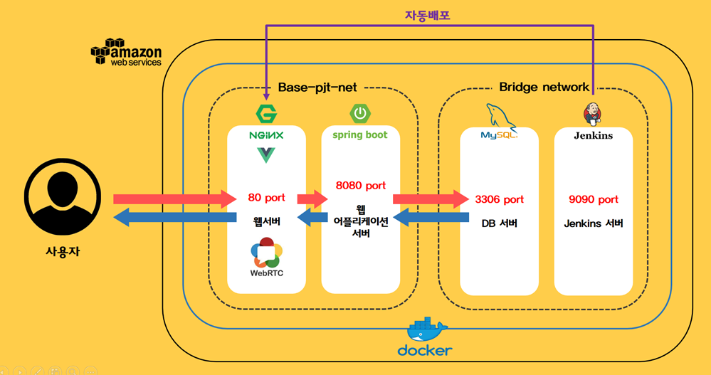
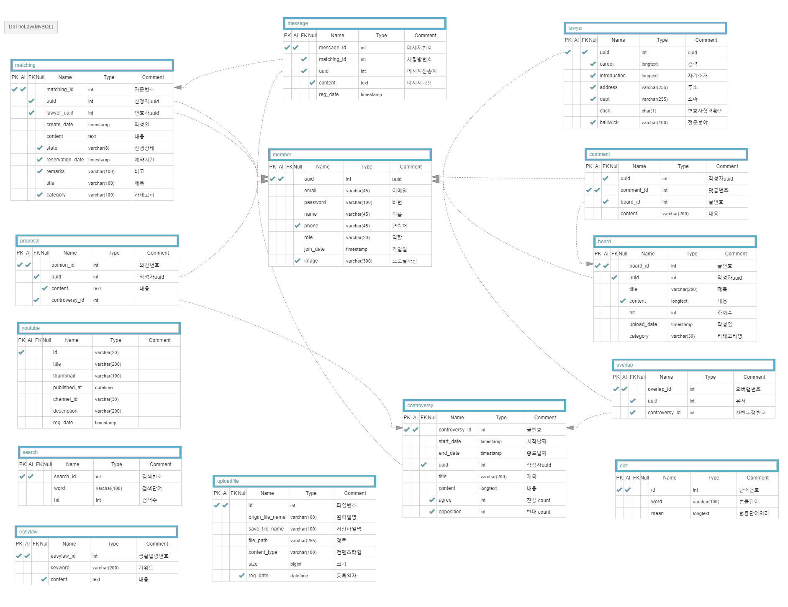
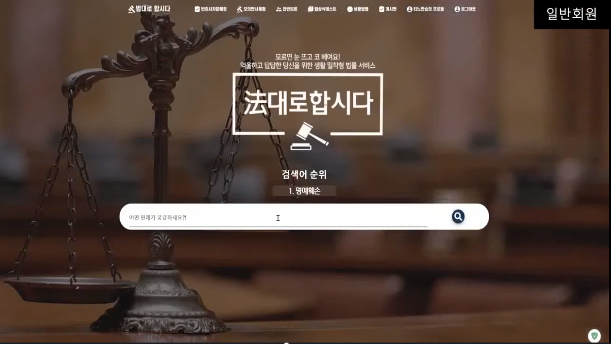
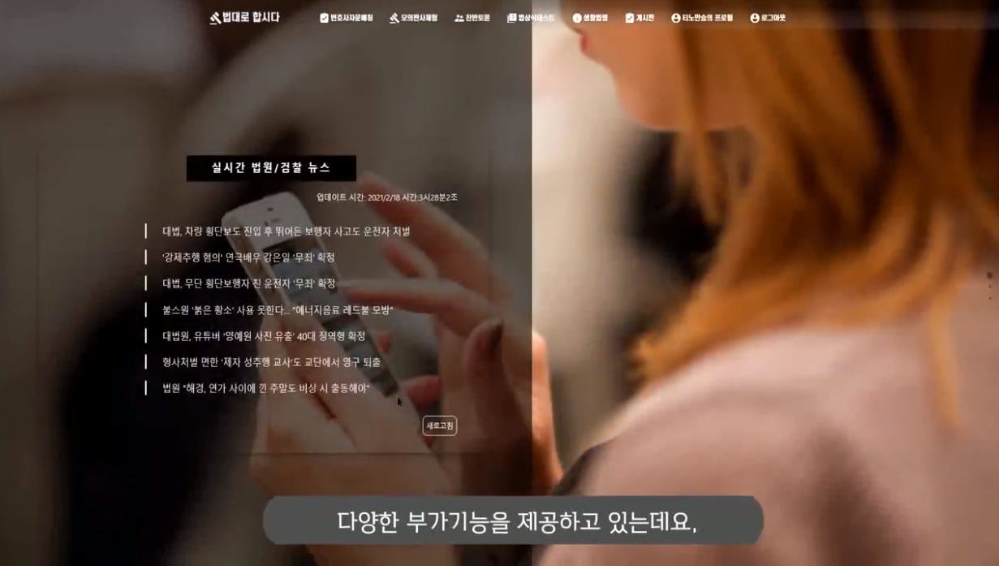
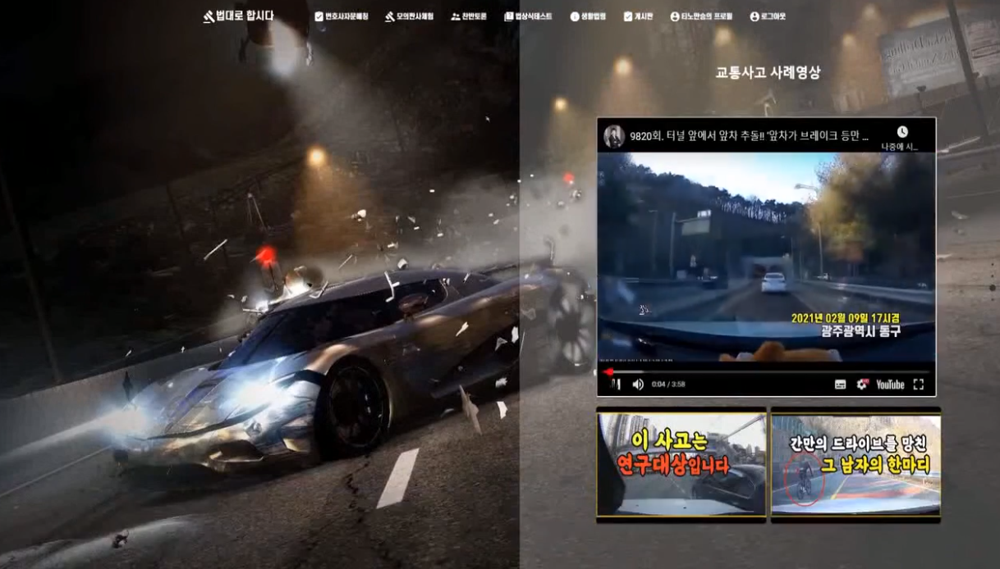
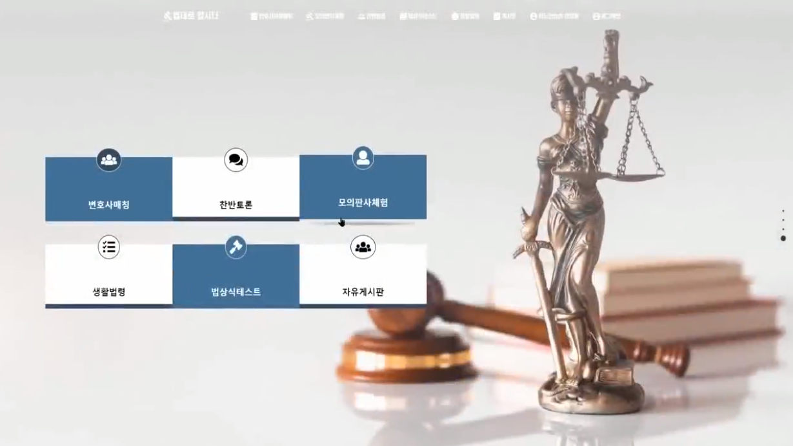
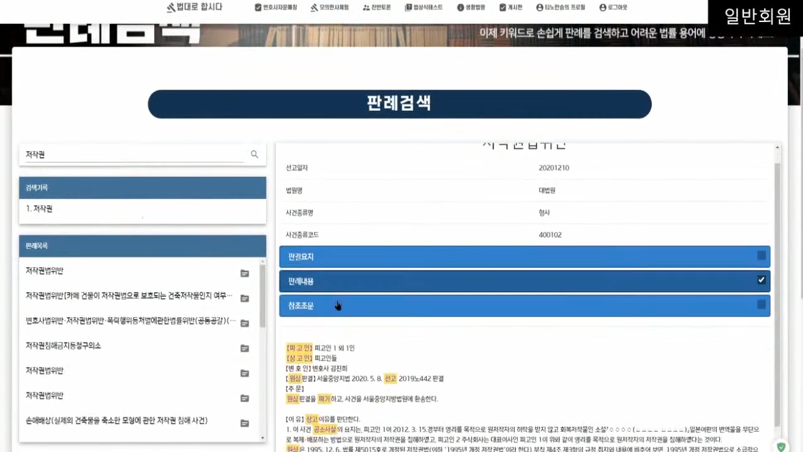
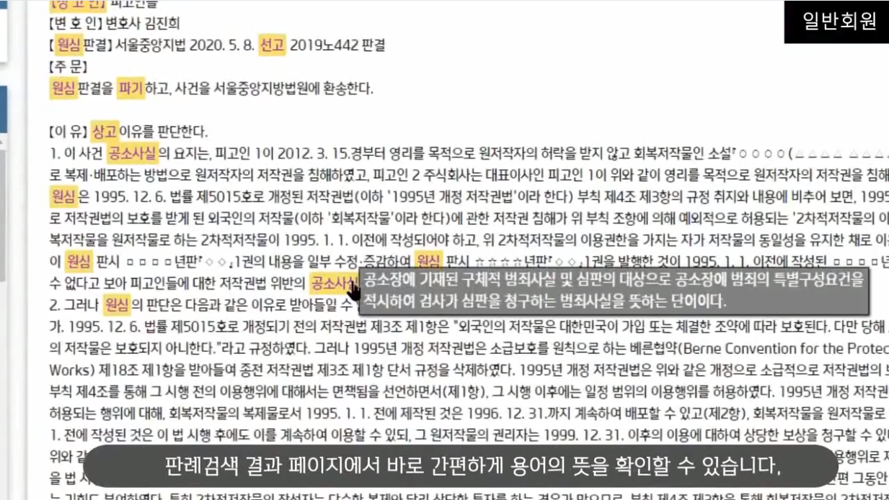
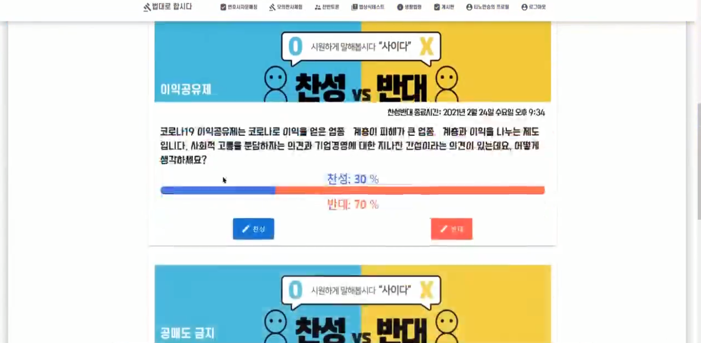

# 法대로합시다
> 국민이 가장 많이 필요로 하는 생활법령을 쉽게 찾아주는 서비스


            

---
## 서비스 소개

#### 기획배경 
생소하고 어려운 법령을 좀 더  쉽게 이해할 수 있고, 법률 자문을 쉽게 받아볼 수 있는  서비스가 있으면 좋겠다는 생각에 서비스를 기획

#### 주요기능

- 국가법령정보 공동활용 Open Data 를 활용하여 주요 판결문 수집
  - 판결문중 어려운단어를 정규 표현식을 활용하여 단어 뜻을 마우스 오버시 법률 단어 해석을 알려줌
- WebRTC를 활용해 법률자문매칭 시스템 구현
  - 변호사별 프로필 리스트 페이지를 두어 등록된 변호사별 전문분야 및 변호사 프로필 확인, 변호사별 매칭 신청 가능 
- 법률 서비스 커뮤니티를 구현하여 사용자에게 더 친숙하게 법률 접근이 가능하도록 구현
  - 유사한 상황을 가진 사람들이 해당 서비스를 통해 각자의 의견상황 공유 및 파일 업로드 다운로드 기능 구현
- 변호사별 프로필 및 회원 프로필의 로직상 분리

---

## 개발환경 실행

​	백엔드 (SpringBoot)
```sh
STS
 File - Import Projects from File System or Archieve
 Import source : /s04p13d103/backend
Run: 프로젝트 우폴더 클릭후 Run As - SpringBootApp
실행백엔드서버: http://localhost:8000
API문서 주소(Swagger): http://localhost:8000/swagger-ui.html
```

​	프론트엔드(vue-js)
```sh
npm install
npm run serve
실행 프론트엔드: http://localhost:8080/
```
---
## 배포환경실행
(현재 서버 중단)
​	AWS웹서비스 주소 : https://i4d103.p.ssafy.io/

​	젠킨스 자동배포 주소 : http://i4d103.p.ssafy.io:9090/

​    Swagger-ui 주소 : https://i4d103.p.ssafy.io/swagger-ui.html

---

## 기술스택




---

## 업무분담

+ 구민진(팀장)
  ​	배포환경(AWS, Docker)구축 및 자동화(Jenkins), Git 관리, Jira 이슈 관리
+ 김두상
  ​	백엔드(SpringBoot) 개발, Database 설계
+ 현진혁
  ​	백엔드(SpringBoot) 개발, Database 설계, 법률 사전 크롤링
+ 윤예준
  ​	프론트엔드(Vue.js) 개발, 서비스기획, OPEN API 연동
+ 이혜지
  ​	프론트엔드(Vue.js) 개발, 서비스기획, UI/UX 디자인
+ 이원회
  ​	프론트엔드(Vue.js) 개발, UI/UX 디자인

---

## ERD 다이어그램




---


## 서비스 구현 화면소개

### 메인페이지 구성
fullpage.js 활용 페이지단위 메인페이지 구성
- 검색어 순위가 vuetify의 v-carosuel을 활용하여 수직으로 3초간격으로 1등부터 10등까지 노출되도록 구현

- 법률뉴스 RSS 파싱 및 링크 연결

- Youtube API를 활용하여 법률 관련 동영상 수집, iframe을 활용한 화면구성

- 디자인된 사이트맵 리스트 구성


---

### 법률검색 페이지 구성
- 국가법령정보 공동활용 Open Data를 활용하여 법률 리스트 

- DB에 저장된 법률단어리스트들을 불러와 정규표현식을 활용하여 html문서 내에서 치환을 하여 hover css 속성중 mark 와 a 태그를 활용하여 마우스 오버시 단어의 정의가 나오도록 구현


---

### 찬반토론 페이지 구성
- Vue의 emit, on 그리고 props를 활용하여 컴포넌트간 통신이 이벤트버스를 활용하여 구현함.


---
